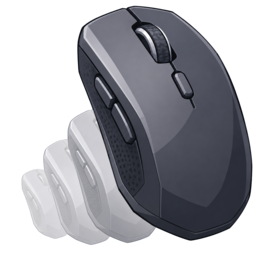

<!-- SPDX-FileCopyrightText: 2026 VisorCraft LLC -->
<!-- SPDX-License-Identifier: MIT -->

<p align="center">
  
</p>

<h1 align="center">Realistic Mouse Jiggler</h1>

<p align="center">
  <b>The realistic desktop mouse jiggler.</b>
  <br />
  Keep sessions awake with natural cursor motion, tray controls, and global start/stop bindings.
  <br />
  Rust core &middot; egui UI &middot; Linux, macOS, Windows &middot; Arch/CachyOS package &middot; no telemetry &middot; MIT.
</p>

<p align="center">
  <a href="https://github.com/visorcraft/realistic-mouse-jiggler/releases/latest"></a>
  <a href="LICENSE"></a>
  
  
  
</p>

---

## What is Realistic Mouse Jiggler?

Realistic Mouse Jiggler keeps desktop sessions awake by moving the cursor
with natural-looking motion. It is built for people who want a small,
predictable utility instead of a bulky background app.

It is built around four goals:

- **Realistic motion.** Smooth movement is available alongside a simple
  horizontal mode.
- **Fast control.** Start or stop from the app window, system tray,
  keyboard keys, shortcuts such as `Ctrl+Alt+F7`, or mouse buttons.
- **Desktop-native behavior.** Closing or minimizing keeps the app
  available from the tray, and KDE/Wayland restore behavior is handled.
- **Simple distribution.** GitHub releases include a Linux tarball,
  signed Windows artifacts, and a signed Arch/CachyOS pacman package.

---

## Install

### Windows

Download the latest signed [Windows installer](https://github.com/visorcraft/realistic-mouse-jiggler/releases/latest/download/realistic-mouse-jiggler.msi) or [standalone `.exe`](https://github.com/visorcraft/realistic-mouse-jiggler/releases/latest/download/realistic-mouse-jiggler.exe).

### Arch / CachyOS

Install directly from the latest signed package:

```bash
curl -fsSL https://github.com/visorcraft/realistic-mouse-jiggler/releases/latest/download/install-arch.sh | bash
```

### Linux Tarball

Download the latest Linux tarball:

```bash
curl -LO https://github.com/visorcraft/realistic-mouse-jiggler/releases/latest/download/realistic-mouse-jiggler-linux-x86_64.tar.gz
```

### macOS

Install from source with Cargo:

```bash
xcode-select --install
curl --proto '=https' --tlsv1.2 -sSf https://sh.rustup.rs | sh
. "$HOME/.cargo/env"
cargo install --locked --git https://github.com/visorcraft/realistic-mouse-jiggler
realistic-mouse-jiggler
```

---

## Runtime Notes

### Linux

Global mouse/key binding capture reads Linux input devices directly on
Wayland. The app needs read access to `/dev/input/event*`; a normal
setup is to run as a user in the `input` group.

For cursor movement on Wayland, the app prefers `ydotool` when it is
installed:

```bash
systemctl --user start ydotool.service
```

Linux tray support uses the freedesktop/KDE StatusNotifierItem protocol
through `ksni`. KDE supports this natively. GNOME users may need an
AppIndicator/StatusNotifier extension.

### macOS

macOS requires Accessibility/Input Monitoring permission for global input
capture and cursor movement:

```text
System Settings -> Privacy & Security -> Accessibility
System Settings -> Privacy & Security -> Input Monitoring
```

Add Terminal or iTerm if launching from the Cargo-installed command.

### Windows

Windows should work without extra system packages. Some security tools
may flag global input hooks; allow the app if you want keyboard/mouse
bindings to work system-wide. Left click cannot be assigned, so app controls
remain usable.

---

## Packaging

Build a local Arch/CachyOS package:

```bash
scripts/build-arch-package.sh --syncdeps
```

Install the local package:

```bash
sudo pacman -U dist/arch/realistic-mouse-jiggler-*.pkg.tar.*
```

Build a static pacman repo directory:

```bash
scripts/build-pacman-repo.sh
```

See [CachyOS and Pacman Packaging](docs/cachyos-packaging.md) for
hosting and CachyOS submission notes.

---

## Architecture

- **`src/app.rs`**: egui UI, close/minimize-to-tray behavior, and
  KDE/Wayland restore helpers.
- **`src/input.rs`**: global keyboard and mouse binding capture.
- **`src/jiggler.rs`**: cursor movement worker.
- **`src/tray.rs`**: system tray integration. Linux uses `ksni`;
  macOS and Windows use `tray-icon`.
- **`src/icons.rs`**: embedded PNG icons and Linux desktop/icon fallback.
- **`packaging/arch/`**: Arch/CachyOS package metadata.

---

## Development Checks

```bash
cargo fmt --check
cargo test --locked
cargo build --release --locked
```

Rust 1.92 or newer is required.

When editing `.github/workflows/release.yml`, also run:

```bash
actionlint .github/workflows/release.yml .github/workflows/test-azure-signing.yml
```

See [Credits](CREDITS.md) and the generated [Third-Party Licenses](docs/credits-third-party.md).
